# Server Setup Guide

This is a step-by-step guides to set up a Debian/Ubuntu server and useful services for a home lab. Use the sections below to follow an OS installation, configure core services, and deploy commonly used applications like Docker, Samba, and Nextcloud.

## Table of Contents

1. [Installer Menu](#1-installer-menu)
2. [Select Language](#2-select-language)
3. [Select Location](#3-select-location)
4. [Configure Keyboard](#4-configure-keyboard)
5. [Set Hostname](#5-set-hostname)
6. [Set Domain Name](#6-set-domain-name)
7. [Root Password](#7-root-password)
8. [Full Name](#8-full-name)
9. [Username](#9-username)
10. [User Password](#10-user-password)
11. [Partition Disks](#11-partition-disks)
12. [Partition Layout](#12-partition-layout)
13. [Confirm Partitions](#13-confirm-partitions)
14. [Mirror Country](#14-mirror-country)
15. [Archive Mirror](#15-archive-mirror)
16. [HTTP Proxy](#16-http-proxy)
17. [Survey](#17-survey)
18. [Software Selection](#18-software-selection)
19. [Installation Complete](#19-installation-complete)
20. [Add User to Sudoers](#add-user-to-sudoers)
    - [20.1 Switch to Root](#201-switch-to-root)
    - [20.2 Update, Upgrade, and Install Sudo](#202-update-upgrade-and-install-sudo)
    - [20.3 Add User to Sudo Group](#203-add-user-to-sudo-group)
    - [20.4 Apply Changes](#204-apply-changes)
21. [Installing Docker](#installing-docker)
22. [Docker Honeygain](#setting-up-honeygain)

---

## Installation Steps

### 1. Installer Menu

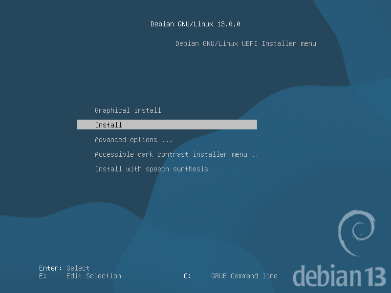  
_Choose "Install" or "Graphical Install" to begin the Debian setup._

### 2. Select Language

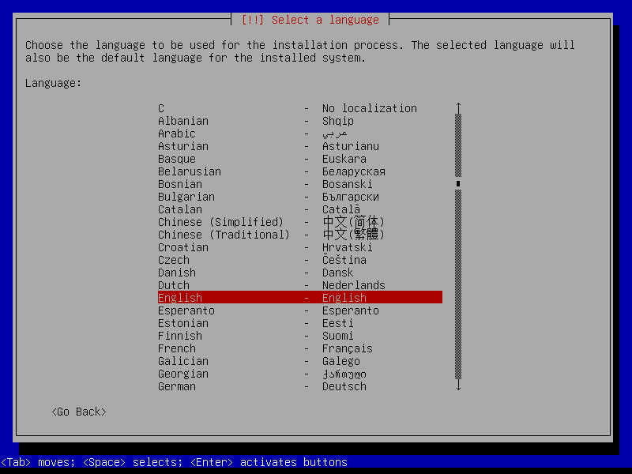  
_Pick the language for your installation process and system._

### 3. Select Location

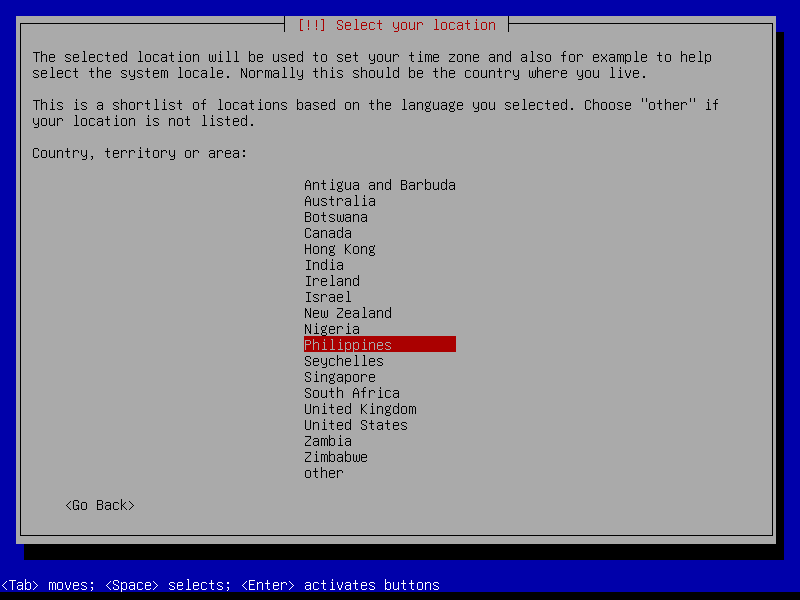  
_Choose your country/region. This also affects time zones and mirrors._

### 4. Configure Keyboard

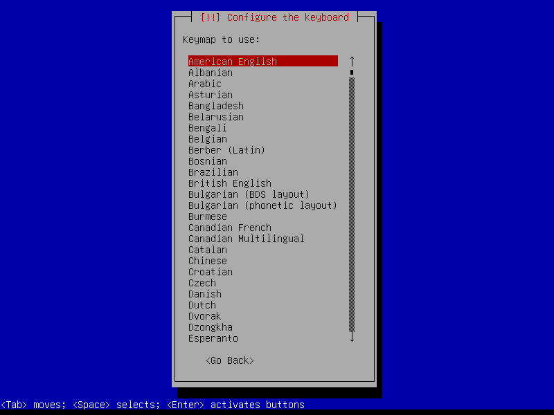  
_Select the keyboard layout you’ll use._

### 5. Set Hostname

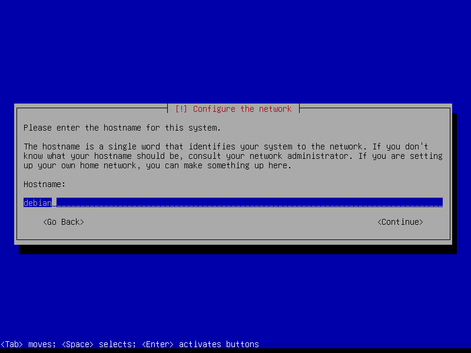  
_Give your server a unique hostname (ex: `linux-hive`)._

### 6. Set Domain Name

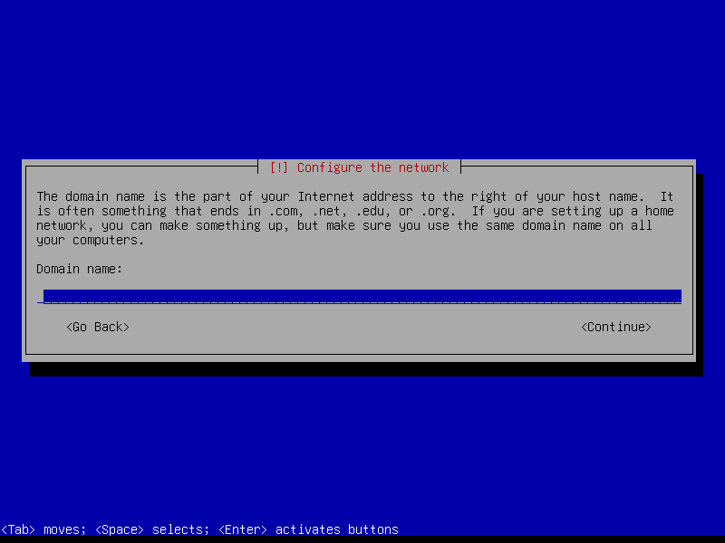  
_Optional for home setups — you can leave it blank if not using domains._

### 7. Root Password

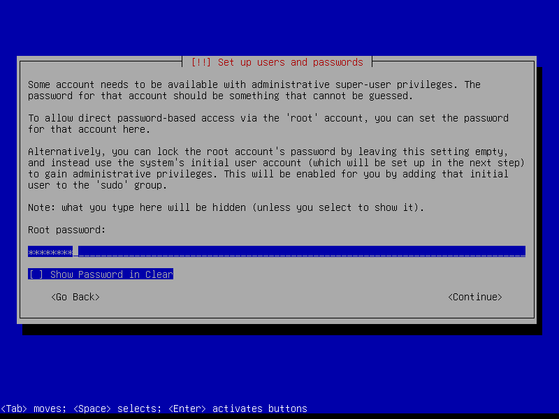  
_Set a strong root password. Don’t lose this!_

### 8. Full Name

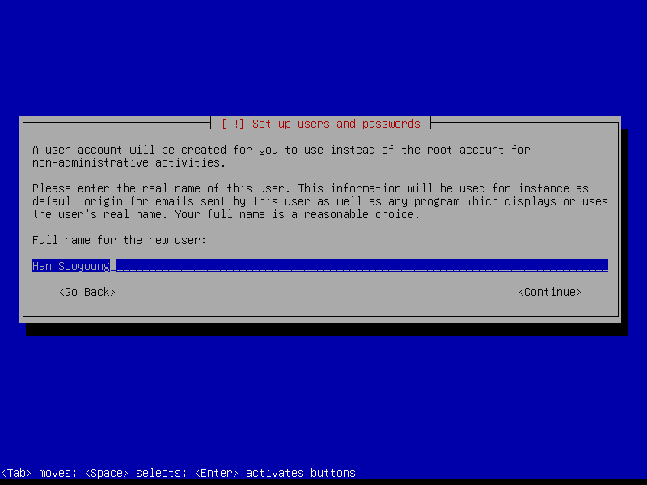  
_Enter the full name of the primary user (for reference only)._

### 9. Username

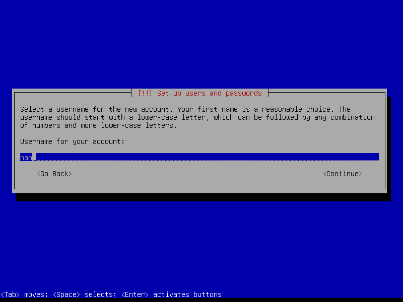  
_Pick your login username (ex: `han`)._

### 10. User Password

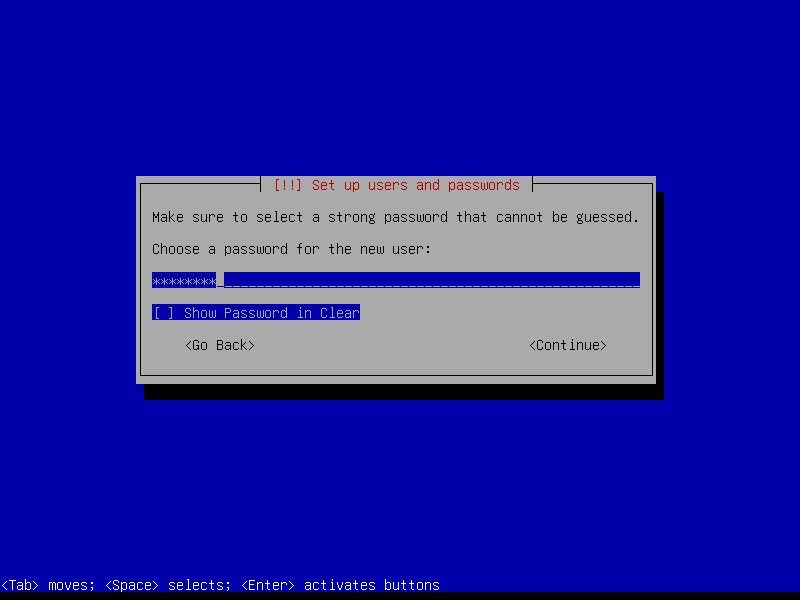  
_Set a strong password for your user account._

### 11. Partition Disks

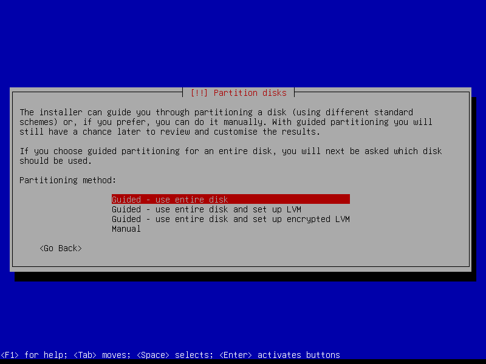  
_Select the method for partitioning. I used "Manual" for full control._

### 12. Partition Layout

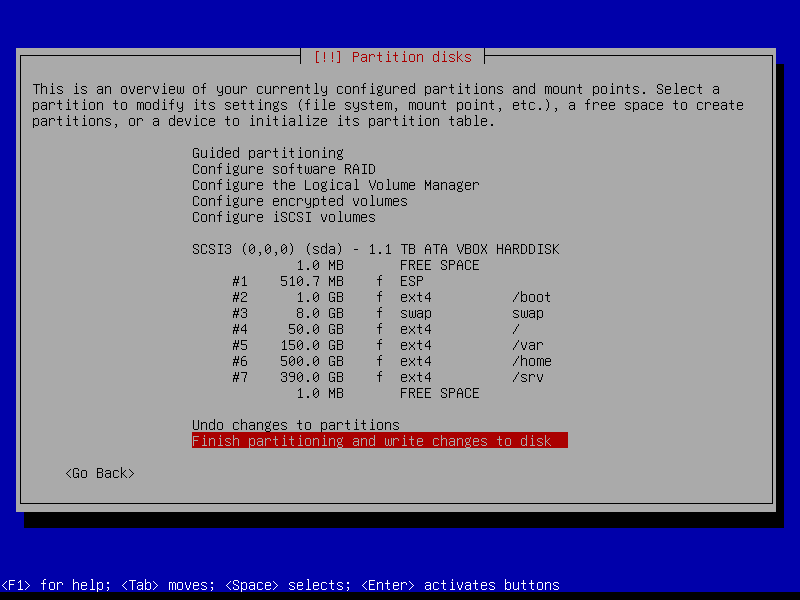  
_Review and adjust your partitions (/, /home, /srv, swap, etc.)._

### 13. Confirm Partitions

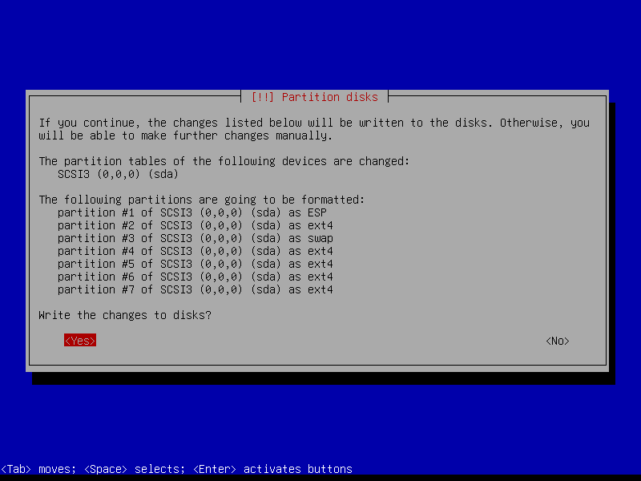  
_Write changes to disk to finalize the partitioning._

### 14. Mirror Country

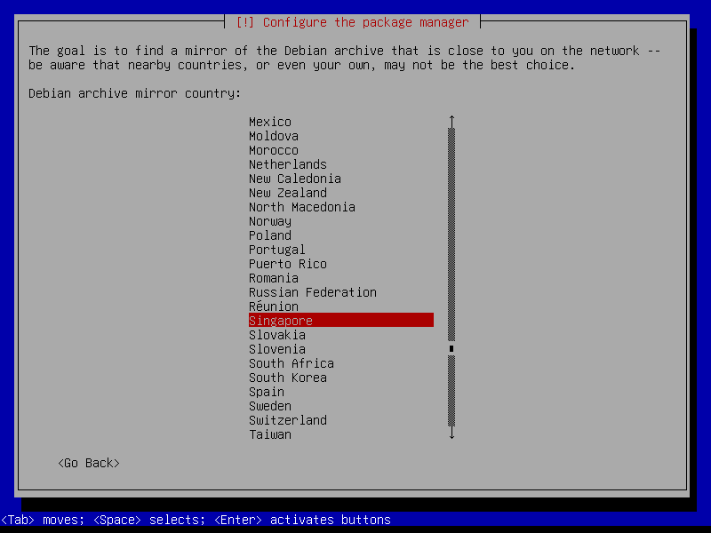  
_Select the country for your Debian package mirror._

### 15. Archive Mirror

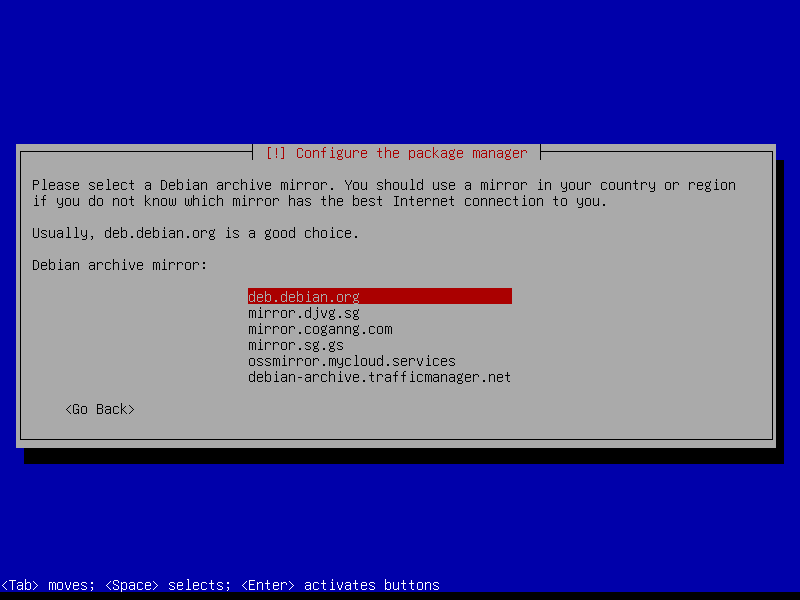  
_Pick the Debian archive mirror for downloading updates/packages._

### 16. HTTP Proxy

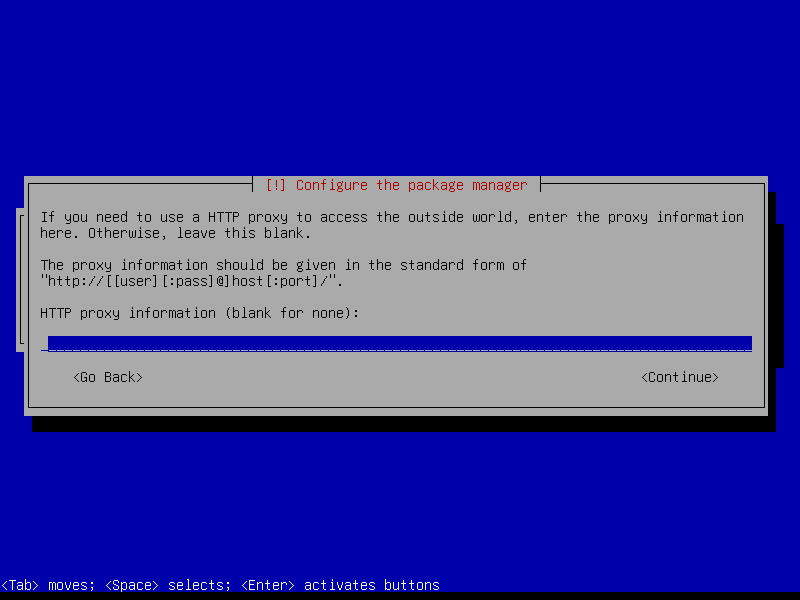  
_Set this only if you’re behind a proxy. Otherwise, leave blank._

### 17. Survey

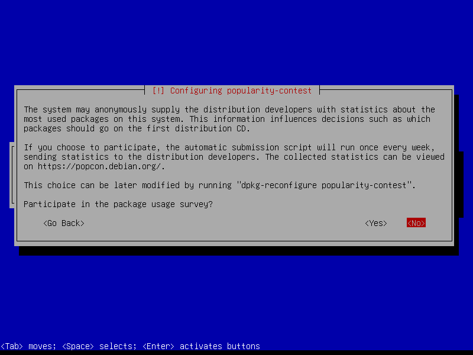  
_Debian asks if you want to participate in usage surveys. Choose yes/no._

### 18. Software Selection

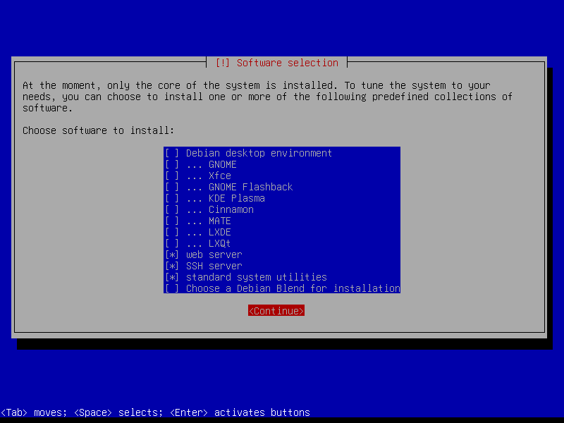  
_Choose which software to install. For servers, select SSH + standard utilities. If you also want to host a Web, choose Web Server_

### 19. Installation Complete

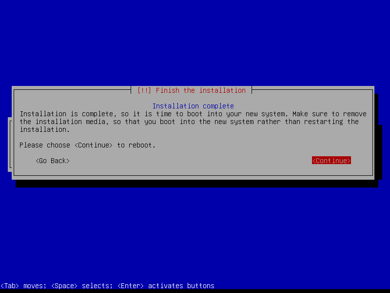  
_Remove installation media, reboot, and enjoy your fresh Debian server!_

## Add User to Sudoers

### 20.1 Switch to Root:

```bash
su
```

_(Enter the root password you set during installation.)_

### 20.2 Update, Upgrade, and Install Sudo

```bash
apt update && apt upgrade
apt install sudo fail2ban
```

### 20.3 Add User to Sudo Group:

```bash
/usr/sbin/usermod -aG sudo your_username
```

_(Replace your_username with your actual login username.)_

### 20.4 Apply Changes

Then reboot to apply changes.

```bash
systemctl reboot
```

OR

```bash
reboot now
```

Your user can now run admin commands with:

```bash
sudo <command>
```

## Installing Docker

[Go to this link and follow the instructions.](https://docs.docker.com/engine/install/debian/)

## Setting up Honeygain

[Docker Honeygain](docker-honeygain.md)
