# Server Setup Guide

## Installation Steps

### 1. Installer Menu
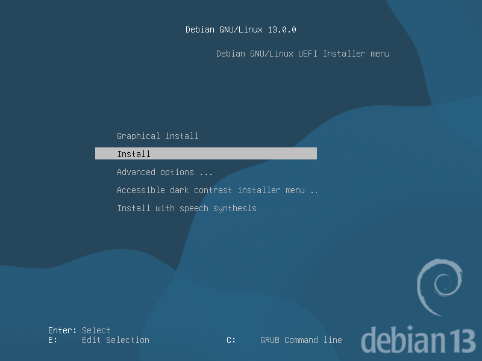  
*Choose "Install" or "Graphical Install" to begin the Debian setup.*

### 2. Select Language
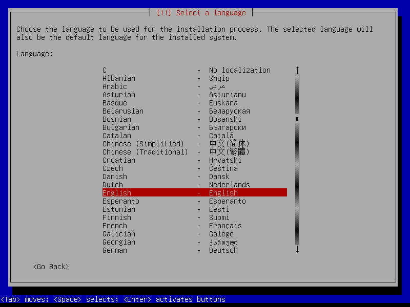  
*Pick the language for your installation process and system.*

### 3. Select Location
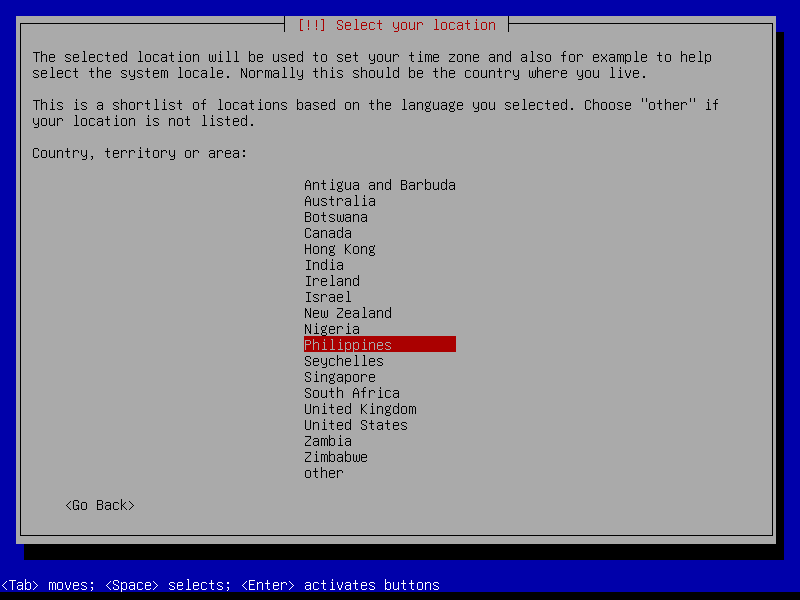  
*Choose your country/region. This also affects time zones and mirrors.*

### 4. Configure Keyboard
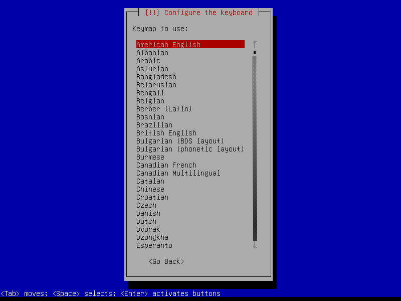  
*Select the keyboard layout you’ll use.*

### 5. Set Hostname
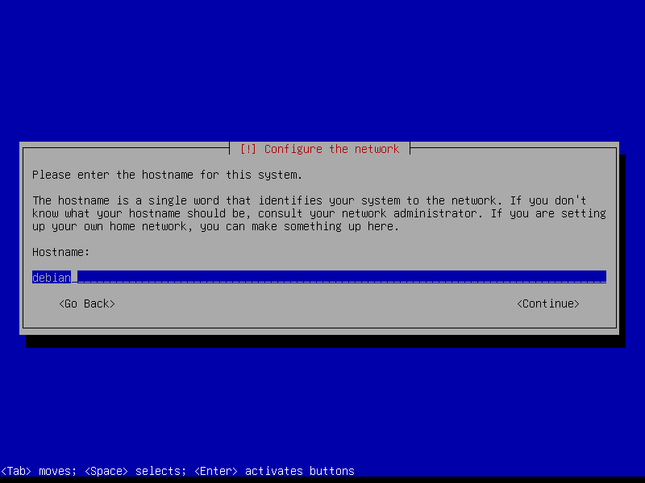  
*Give your server a unique hostname (ex: `linux-hive`).*

### 6. Set Domain Name
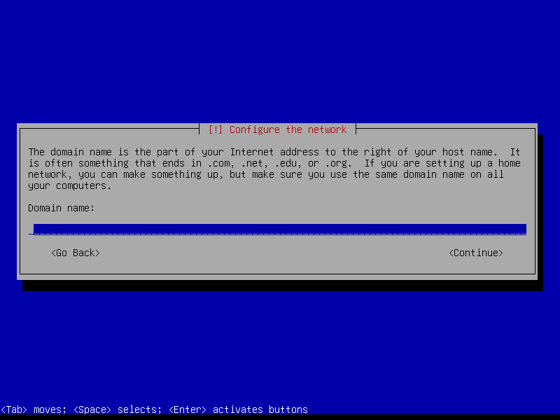  
*Optional for home setups — you can leave it blank if not using domains.*

### 7. Root Password
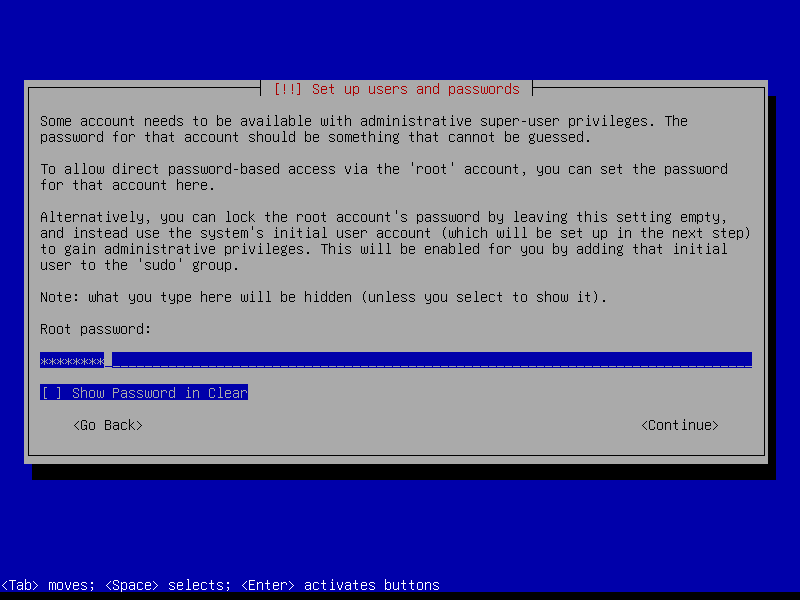  
*Set a strong root password. Don’t lose this!*

### 8. Full Name
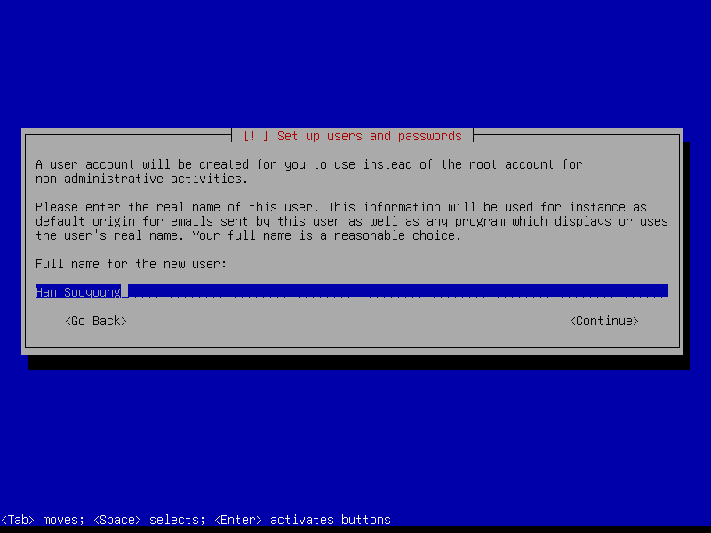  
*Enter the full name of the primary user (for reference only).*

### 9. Username
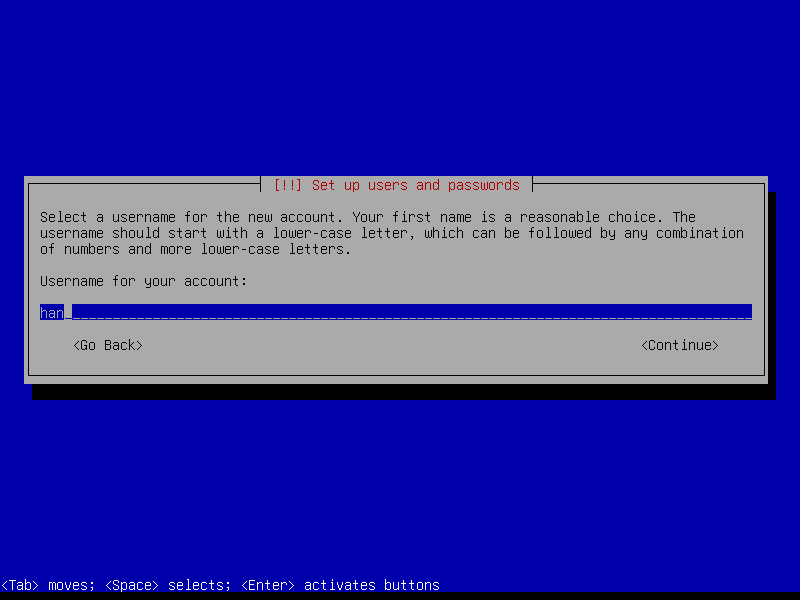  
*Pick your login username (ex: `wacky`).*

### 10. User Password
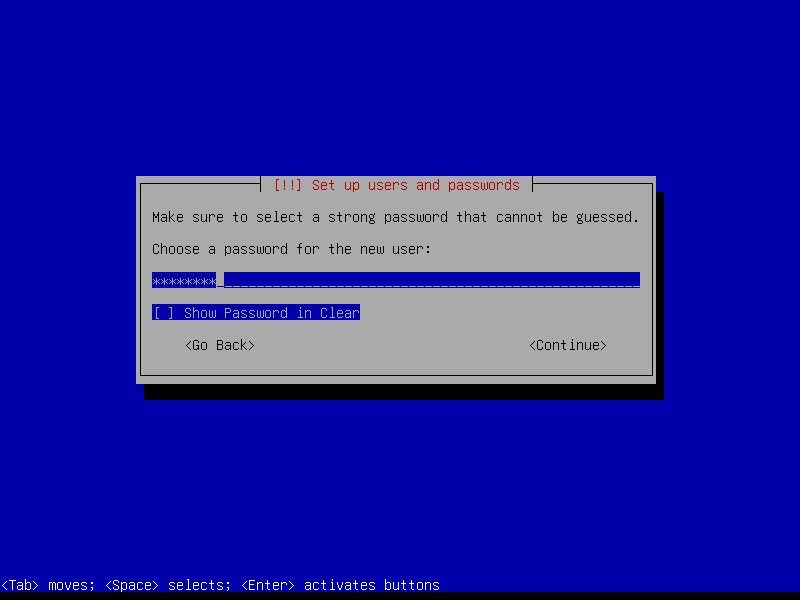  
*Set a strong password for your user account.*

### 11. Partition Disks
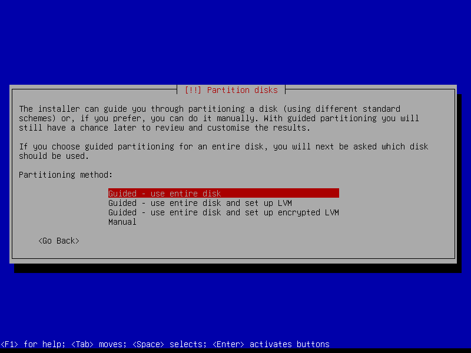  
*Select the method for partitioning. Use "Manual" for full control.*

### 12. Partition Layout
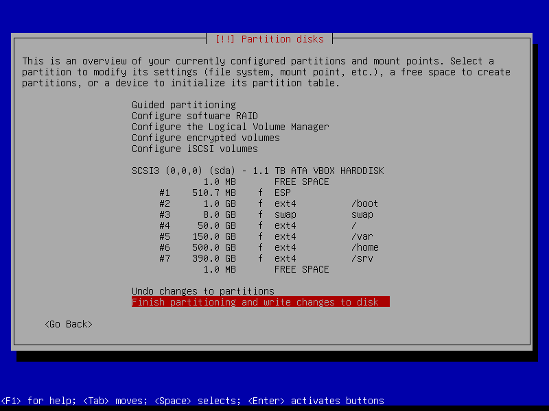  
*Review and adjust your partitions (/, /home, /srv, swap, etc.).*

### 13. Confirm Partitions
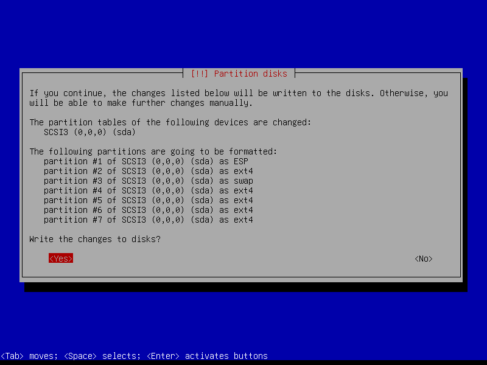  
*Write changes to disk to finalize the partitioning.*

### 14. Mirror Country
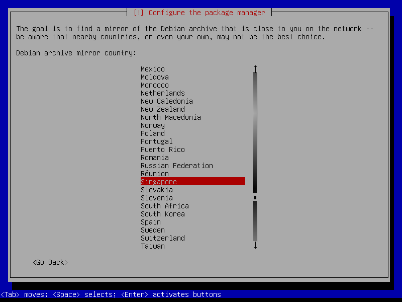  
*Select the country for your Debian package mirror.*

### 15. Archive Mirror
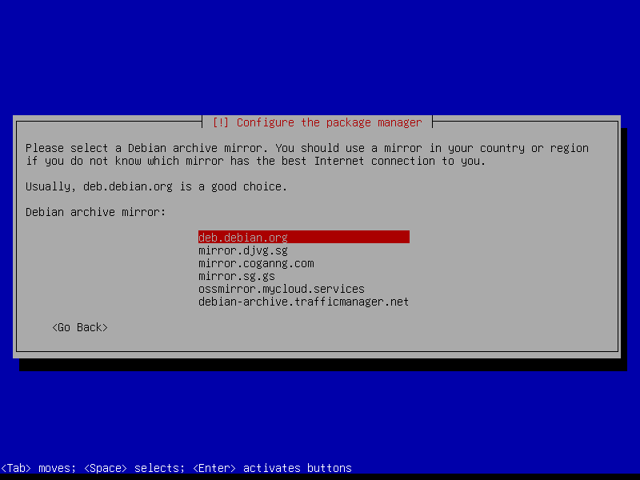  
*Pick the Debian archive mirror for downloading updates/packages.*

### 16. HTTP Proxy
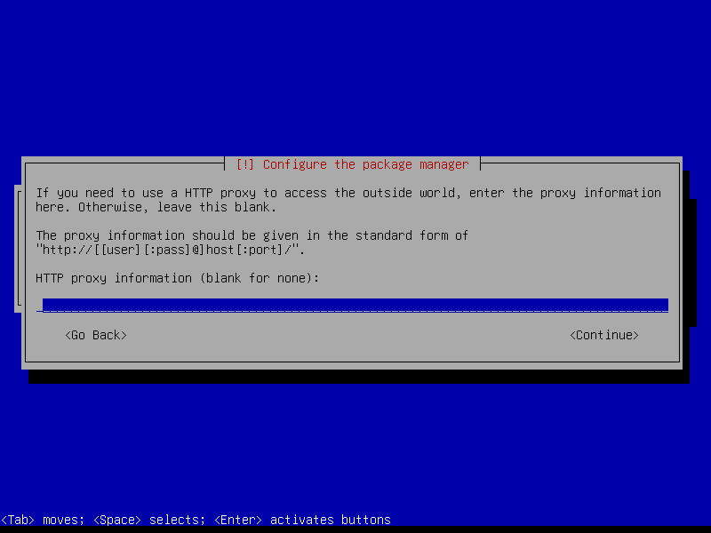  
*Set this only if you’re behind a proxy. Otherwise, leave blank.*

### 17. Survey
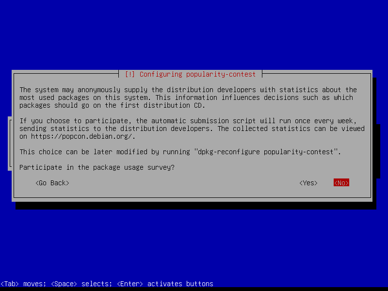  
*Debian asks if you want to participate in usage surveys. Choose yes/no.*

### 18. Software Selection
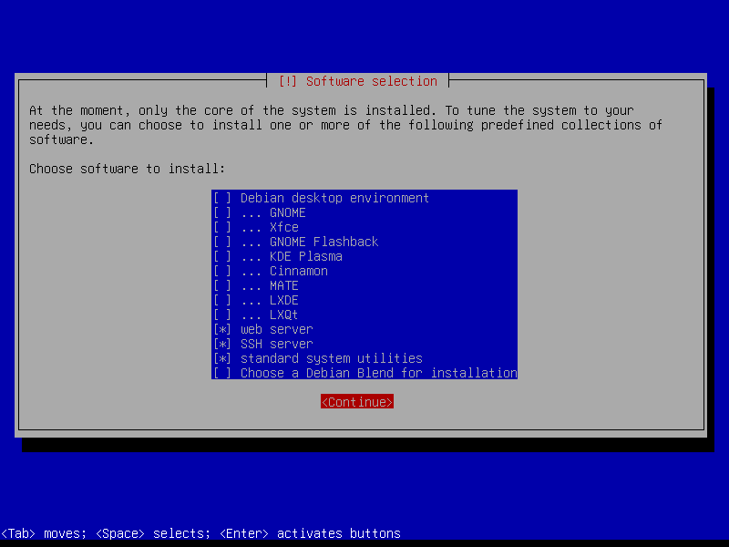  
*Choose which software to install. For servers, select SSH + standard utilities.*

### 19. Installation Complete
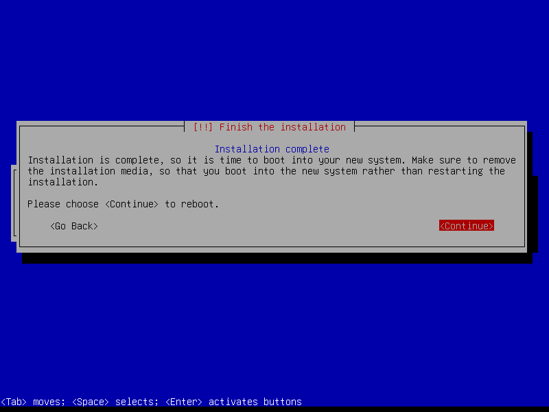  
*Remove installation media, reboot, and enjoy your fresh Debian server! 🎉*
