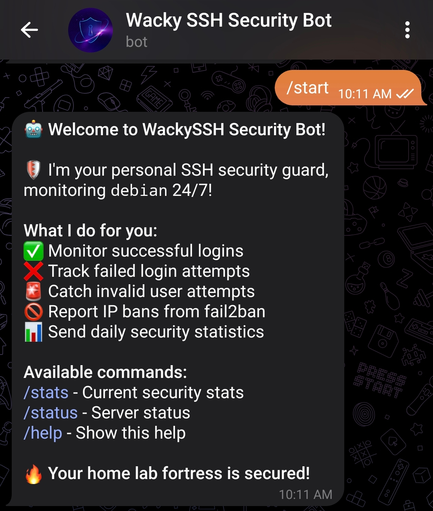
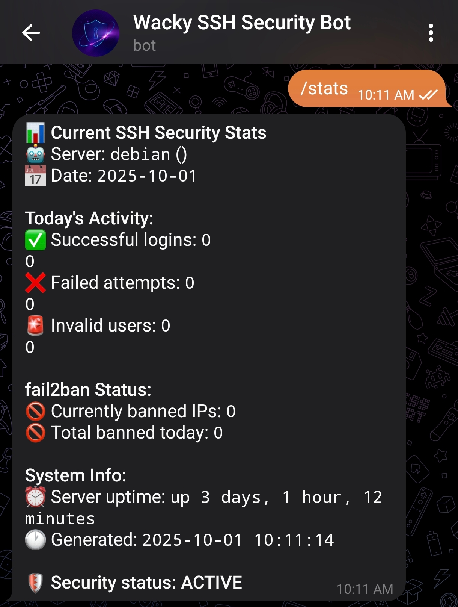
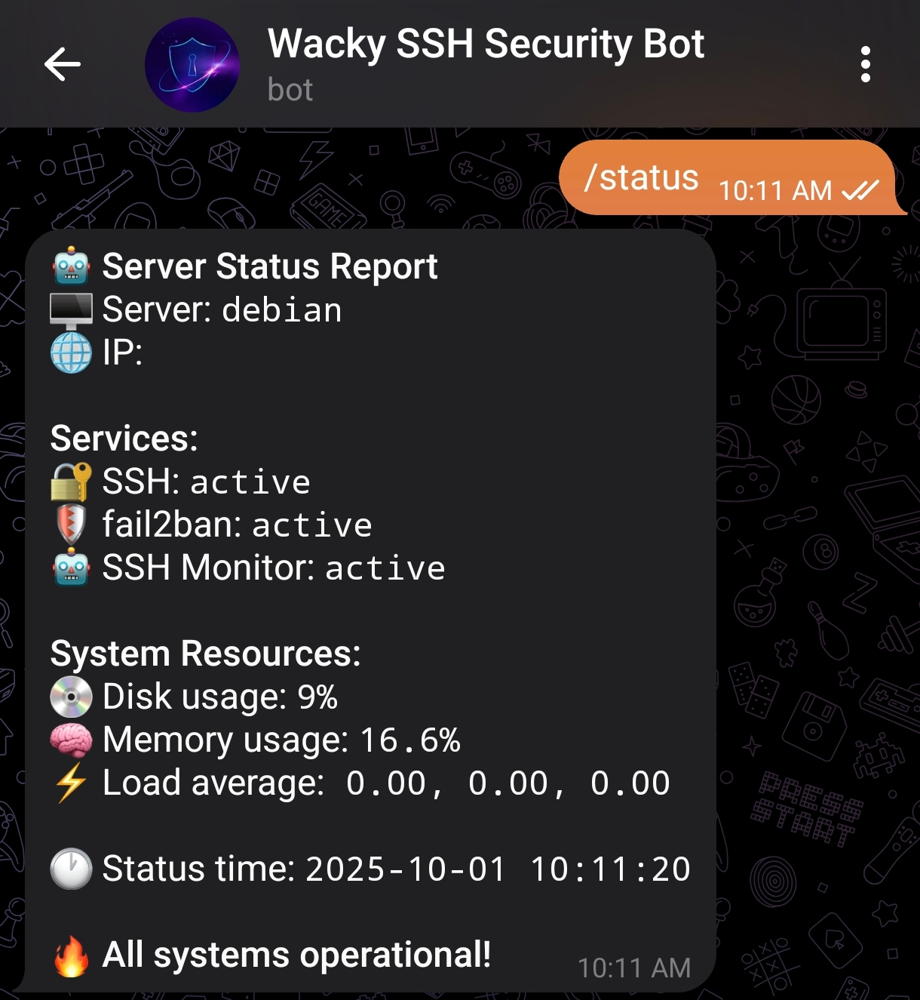
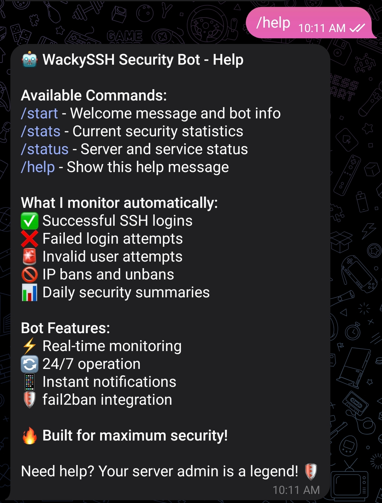

# Telegram Bot Guide

## What You'll Have When Done

By the end of this guide, you'll have built a comprehensive SSH security monitoring system that rivals enterprise-grade setups:

### Bulletproof SSH Configuration:

Custom port (hiding from automated scans)
Key-only authentication (no password attacks possible)
User access restrictions (only your account allowed)
Connection limits and timeouts
fail2ban automatically banning attackers

### Personal Security Bot:

Real-time Telegram notifications for all SSH activity
Instant alerts when IPs get banned
Daily security statistics delivered to your phone
Interactive commands to check server status anytime
Professional bot with custom commands and descriptions

### 24/7 Automated Monitoring:

Continuous log monitoring via systemd services
Automatic detection of failed logins, invalid users, and successful connections
fail2ban integration with instant ban notifications
Scheduled daily reports with security metrics






### Enterprise Features:

Service redundancy with automatic restarts
Proper logging and error handling
JSON parsing for reliable message processing
Offset tracking to prevent duplicate notifications

### End Result:

Your home lab server becomes virtually unbreachable to automated attacks while keeping you informed of all security events through a custom Telegram bot. You'll sleep better knowing your system actively hunts down attackers and reports everything in real-time to your phone.
This setup typically costs thousands when purchased as a managed security service, but you'll build it yourself using open-source tools and gain deep understanding of SSH security in the process.

## Prerequisites

- Debian/Ubuntu Linux server
- Basic command line knowledge
- Telegram account
- SSH access to your server

### Step 1: Create the Telegram Bot

1. Message **@BotFather** on Telegram
2. click **/start**
3. Send **/newbot**
4. Give it a name like **"SSH Security Bot"**
5. Give it a username like **"your_ssh_security_bot"**
6. Copy the bot token **(looks like 123456789:ABCdefGhIjKlMnOpQrStUvWxYz)**

### Step 2: Get your Chat ID and Test Bot

1. Message your new bot
2. Clic **/start**
3. Send a message
4. Visit: **https://api.telegram.org/bot<YOUR_BOT_TOKEN>/getUpdates**
5. Find your chat_id in the JSON response, something like this:

```bash
"chat": {
          "id": ,
```

If this doesn't work, try this method I used:

```bash
curl https://api.telegram.org/bot<YOUR_BOT_TOKEN>/getUpdates
```

### Step 3: Creating monitoring directory

```bash
sudo mkdir -p /opt/ssh-monitor
cd /opt/ssh-monitor
```

### Step 4: Create Main Monitoring Script

**Note:** Fill in the double quotation with your **Bot Token** and **Chat ID**. I put **'# Fill'** on the lines.

```bash
#!/bin/bash

# Configuration
BOT_TOKEN="" # Fill
CHAT_ID="" # Fill
HOSTNAME=$(hostname)
SERVER_IP=$(hostname -I | awk '{print $1}')

# Emojis for style 💯
EMOJI_BAN="🚫"
EMOJI_SUCCESS="✅"
EMOJI_FAIL="❌"
EMOJI_UNBAN="🔓"
EMOJI_STATS="📊"
EMOJI_ALERT="🚨"
EMOJI_ROBOT="🤖"

# Function to send Telegram message
send_telegram() {
    local message="$1"
    curl -s -X POST \
        "https://api.telegram.org/bot${BOT_TOKEN}/sendMessage" \
        -d "chat_id=${CHAT_ID}" \
        -d "text=${message}" \
        -d "parse_mode=Markdown" >/dev/null 2>&1
}

# Function to get current timestamp
get_timestamp() {
    date '+%Y-%m-%d %H:%M:%S'
}

# Monitor SSH attempts
monitor_ssh() {
    local logfile="/tmp/ssh_monitor.log"

    # Initialize log position
    if [ ! -f "$logfile" ]; then
        journalctl -u ssh --since "1 minute ago" -n 0 > "$logfile"
    fi

    # Get new log entries
    local new_logs=$(journalctl -u ssh --since "1 minute ago" -o short-iso)

    # Process new entries
    while IFS= read -r line; do
        local timestamp=$(echo "$line" | awk '{print $1}')
        local message=$(echo "$line" | cut -d' ' -f4-)

        # Failed password attempts
        if echo "$line" | grep -q "Failed password"; then
            local user=$(echo "$line" | grep -o "Failed password for [^ ]*" | awk '{print $4}')
            local ip=$(echo "$line" | grep -o "from [0-9.]*" | awk '{print $2}')
            send_telegram "${EMOJI_FAIL} *SSH Failed Login*
${EMOJI_ROBOT} Server: \`${HOSTNAME}\`
👤 User: \`${user}\`
🌐 IP: \`${ip}\`
🕐 Time: \`$(get_timestamp)\`"
        fi

        # Successful logins
        if echo "$line" | grep -q "Accepted publickey"; then
            local user=$(echo "$line" | grep -o "Accepted publickey for [^ ]*" | awk '{print $4}')
            local ip=$(echo "$line" | grep -o "from [0-9.]*" | awk '{print $2}')
            send_telegram "${EMOJI_SUCCESS} *SSH Successful Login*
${EMOJI_ROBOT} Server: \`${HOSTNAME}\`
👤 User: \`${user}\`
🌐 IP: \`${ip}\`
🕐 Time: \`$(get_timestamp)\`"
        fi

        # Invalid user attempts
        if echo "$line" | grep -q "Invalid user"; then
            local user=$(echo "$line" | grep -o "Invalid user [^ ]*" | awk '{print $3}')
            local ip=$(echo "$line" | grep -o "from [0-9.]*" | awk '{print $2}')
            send_telegram "${EMOJI_ALERT} *SSH Invalid User*
${EMOJI_ROBOT} Server: \`${HOSTNAME}\`
👤 Attempted User: \`${user}\`
🌐 IP: \`${ip}\`
🕐 Time: \`$(get_timestamp)\`"
        fi

    done <<< "$new_logs"
}

# Monitor fail2ban
monitor_fail2ban() {
    local logfile="/var/log/fail2ban.log"
    local position_file="/tmp/fail2ban_position"

    # Initialize position file
    if [ ! -f "$position_file" ]; then
        wc -l < "$logfile" > "$position_file"
        return
    fi

    local last_line=$(cat "$position_file")
    local current_line=$(wc -l < "$logfile")

    if [ "$current_line" -gt "$last_line" ]; then
        local new_lines=$((current_line - last_line))
        tail -n "$new_lines" "$logfile" | while IFS= read -r line; do
            # Ban notifications
            if echo "$line" | grep -q "NOTICE.*Ban"; then
                local ip=$(echo "$line" | grep -o "Ban [0-9.]*" | awk '{print $2}')
                local jail=$(echo "$line" | grep -o "\[.*\]" | tr -d '[]')
                send_telegram "${EMOJI_BAN} *IP BANNED!*
${EMOJI_ROBOT} Server: \`${HOSTNAME}\`
🚫 Banned IP: \`${ip}\`
🔒 Jail: \`${jail}\`
🕐 Time: \`$(get_timestamp)\`
💪 *Get rekt, script kiddie!*"
            fi

            # Unban notifications
            if echo "$line" | grep -q "NOTICE.*Unban"; then
                local ip=$(echo "$line" | grep -o "Unban [0-9.]*" | awk '{print $2}')
                local jail=$(echo "$line" | grep -o "\[.*\]" | tr -d '[]')
                send_telegram "${EMOJI_UNBAN} *IP Unbanned*
${EMOJI_ROBOT} Server: \`${HOSTNAME}\`
🔓 Unbanned IP: \`${ip}\`
🔒 Jail: \`${jail}\`
🕐 Time: \`$(get_timestamp)\`"
            fi
        done

        echo "$current_line" > "$position_file"
    fi
}

# Generate daily stats
daily_stats() {
    local today=$(date '+%Y-%m-%d')
    local banned_today=$(fail2ban-client status sshd | grep "Total banned" | awk '{print $4}')
    local failed_today=$(journalctl -u ssh --since "today" | grep -c "Failed password" || echo "0")
    local success_today=$(journalctl -u ssh --since "today" | grep -c "Accepted publickey" || echo "0")
    local invalid_today=$(journalctl -u ssh --since "today" | grep -c "Invalid user" || echo "0")

    send_telegram "${EMOJI_STATS} *Daily SSH Stats - ${today}*
${EMOJI_ROBOT} Server: \`${HOSTNAME}\` (${SERVER_IP})

${EMOJI_SUCCESS} Successful logins: \`${success_today}\`
${EMOJI_FAIL} Failed attempts: \`${failed_today}\`
${EMOJI_ALERT} Invalid users: \`${invalid_today}\`
${EMOJI_BAN} Total bans: \`${banned_today}\`

🛡️ *Your fortress is secure!*"
}

# Main monitoring loop
case "${1}" in
    "monitor")
        while true; do
            monitor_ssh
            monitor_fail2ban
            sleep 60
        done
        ;;
    "stats")
        daily_stats
        ;;
    "test")
        send_telegram "${EMOJI_ROBOT} *SSH Monitor Test*
Server: \`${HOSTNAME}\`
Status: \`Online and monitoring\`
Time: \`$(get_timestamp)\`
🔥 *Ready to catch hackers!*"
        ;;
    *)
        echo "Usage: $0 {monitor|stats|test}"
        echo "  monitor - Start continuous monitoring"
        echo "  stats   - Send daily statistics"
        echo "  test    - Send test message"
        exit 1
        ;;
esac
```

Save the script

```bash
sudo nano ssh_telegram_monitor.sh
```

Make it executable

```bash
sudo chmod +x ssh_telegram_monitor.sh
```

Test it works

```bash
sudo ./ssh_telegram_monitor.sh test
```

Check your phone - you should get a test message!

### Step 5: Configure System Service

Now create a systemd service to run it 24/7:

```bash
sudo nano /etc/systemd/system/ssh-monitor.service
```

Service config:

```bash
[Unit]
Description=SSH Telegram Monitor
After=network.target

[Service]
Type=simple
User=root
WorkingDirectory=/opt/ssh-monitor
ExecStart=/opt/ssh-monitor/ssh_telegram_monitor.sh monitor
Restart=always
RestartSec=10

[Install]
WantedBy=multi-user.target
```

Start the monitoring:

```bash
sudo systemctl daemon-reload
sudo systemctl enable ssh-monitor
sudo systemctl start ssh-monitor
```

### Step 6: Schedule Daily Stats

Crontab = Cron Table - it's Linux's built-in scheduler! It runs commands automatically at specific times.
Set up daily stats (crontab):

```bash
sudo crontab -e
```

Add this line:

```bash
0 9 * * * /opt/ssh-monitor/ssh_telegram_monitor.sh stats
```

It is like this:

```bash
minute hour day month weekday command
  |     |    |    |      |       |
  |     |    |    |      |       +-- Command to run
  |     |    |    |      +---------- Day of week (0-7, Sunday=0 or 7)
  |     |    |    +----------------- Month (1-12)
  |     |    +---------------------- Day of month (1-31)
  |     +--------------------------- Hour (0-23)
  +--------------------------------- Minute (0-59)
```

### Step 7: Add Interactive Commands

### Step 1: Configure Bot Commands

1. Type **/mybots** to **BotFather**
2. Click on your bot
3. Then click **"Edit Bot"**
4. Then click **"Edit Commands"**
   Paste this:

```bash
start - Start monitoring notifications
stats - Get current security statistics
status - Check server status
help - Show available commands
```

### Step 2: Create Command Handler Script

**Note:** Fill in the double quotation with your **Bot Token** and **Chat ID**. I put **'# Fill'** on the lines.

```bash
cd /opt/ssh-monitor
```

```bash
#!/bin/bash

# Handles /start, /stats, /status, /help commands

# Configuration
BOT_TOKEN="" # Fill
CHAT_ID="" # Fill
HOSTNAME=$(hostname)
SERVER_IP=$(hostname -I | awk '{print $1}')
OFFSET_FILE="/tmp/telegram_offset"

# Emojis
EMOJI_ROBOT="🤖"
EMOJI_STATS="📊"
EMOJI_SUCCESS="✅"
EMOJI_FAIL="❌"
EMOJI_BAN="🚫"
EMOJI_ALERT="🚨"
EMOJI_SHIELD="🛡️"
EMOJI_FIRE="🔥"

# Function to send Telegram message
send_message() {
    local chat_id="$1"
    local message="$2"
    curl -s -X POST \
        "https://api.telegram.org/bot${BOT_TOKEN}/sendMessage" \
        -d "chat_id=${chat_id}" \
        -d "text=${message}" \
        -d "parse_mode=Markdown" >/dev/null 2>&1
}

# Function to get current timestamp
get_timestamp() {
    date '+%Y-%m-%d %H:%M:%S'
}

# Handle /start command
handle_start() {
    local chat_id="$1"
    local message="${EMOJI_ROBOT} *Welcome to WackySSH Security Bot!*

${EMOJI_SHIELD} I'm your personal SSH security guard, monitoring \`${HOSTNAME}\` 24/7!

*What I do for you:*
${EMOJI_SUCCESS} Monitor successful logins
${EMOJI_FAIL} Track failed login attempts
${EMOJI_ALERT} Catch invalid user attempts
${EMOJI_BAN} Report IP bans from fail2ban
${EMOJI_STATS} Send daily security statistics

*Available commands:*
/stats - Current security stats
/status - Server status
/help - Show this help

${EMOJI_FIRE} *Your home lab fortress is secured!*"

    send_message "$chat_id" "$message"
}

# Handle /stats command
handle_stats() {
    local chat_id="$1"
    local today=$(date '+%Y-%m-%d')
    local banned_total=$(fail2ban-client status sshd 2>/dev/null | grep "Total banned" | awk '{print $4}' || echo "0")
    local banned_current=$(fail2ban-client status sshd 2>/dev/null | grep "Currently banned" | awk '{print $4}' || echo "0")
    local failed_today=$(journalctl -u ssh --since "today" 2>/dev/null | grep -c "Failed password" || echo "0")
    local success_today=$(journalctl -u ssh --since "today" 2>/dev/null | grep -c "Accepted publickey" || echo "0")
    local invalid_today=$(journalctl -u ssh --since "today" 2>/dev/null | grep -c "Invalid user" || echo "0")
    local uptime=$(uptime -p)

    local message="${EMOJI_STATS} *Current SSH Security Stats*
${EMOJI_ROBOT} Server: \`${HOSTNAME}\` (${SERVER_IP})
📅 Date: \`${today}\`

*Today's Activity:*
${EMOJI_SUCCESS} Successful logins: \`${success_today}\`
${EMOJI_FAIL} Failed attempts: \`${failed_today}\`
${EMOJI_ALERT} Invalid users: \`${invalid_today}\`

*fail2ban Status:*
${EMOJI_BAN} Currently banned IPs: \`${banned_current}\`
${EMOJI_BAN} Total banned today: \`${banned_total}\`

*System Info:*
⏰ Server uptime: \`${uptime}\`
🕐 Generated: \`$(get_timestamp)\`

${EMOJI_SHIELD} *Security status: ACTIVE*"

    send_message "$chat_id" "$message"
}

# Handle /status command
handle_status() {
    local chat_id="$1"
    local ssh_status=$(systemctl is-active ssh)
    local fail2ban_status=$(systemctl is-active fail2ban)
    local monitor_status=$(systemctl is-active ssh-monitor 2>/dev/null || echo "unknown")
    local load=$(uptime | awk -F'load average:' '{ print $2 }')
    local disk_usage=$(df -h / | awk 'NR==2{printf "%s", $5}')
    local memory_usage=$(free | awk 'NR==2{printf "%.1f%%", $3*100/$2 }')

    local message="${EMOJI_ROBOT} *Server Status Report*
🖥️ Server: \`${HOSTNAME}\`
🌐 IP: \`${SERVER_IP}\`

*Services:*
🔐 SSH: \`${ssh_status}\`
🛡️ fail2ban: \`${fail2ban_status}\`
${EMOJI_ROBOT} SSH Monitor: \`${monitor_status}\`

*System Resources:*
💿 Disk usage: \`${disk_usage}\`
🧠 Memory usage: \`${memory_usage}\`
⚡ Load average:\`${load}\`

🕐 Status time: \`$(get_timestamp)\`

${EMOJI_FIRE} *All systems operational!*"

    send_message "$chat_id" "$message"
}

# Handle /help command
handle_help() {
    local chat_id="$1"
    local message="${EMOJI_ROBOT} *WackySSH Security Bot - Help*

*Available Commands:*
/start - Welcome message and bot info
/stats - Current security statistics
/status - Server and service status
/help - Show this help message

*What I monitor automatically:*
${EMOJI_SUCCESS} Successful SSH logins
${EMOJI_FAIL} Failed login attempts
${EMOJI_ALERT} Invalid user attempts
${EMOJI_BAN} IP bans and unbans
📊 Daily security summaries

*Bot Features:*
⚡ Real-time monitoring
🔄 24/7 operation
📱 Instant notifications
🛡️ fail2ban integration

${EMOJI_FIRE} *Built for maximum security!*

Need help? Your server admin is a legend! ${EMOJI_SHIELD}"

    send_message "$chat_id" "$message"
}

# Main function to check for new messages and handle commands
check_messages() {
    # Get last processed update ID
    local offset=0
    if [ -f "$OFFSET_FILE" ]; then
        offset=$(cat "$OFFSET_FILE")
    fi

    # Get new updates
    local updates=$(curl -s "https://api.telegram.org/bot${BOT_TOKEN}/getUpdates?offset=$((offset + 1))&timeout=10")

    # Process each update
    echo "$updates" | jq -r '.result[]? | @base64' 2>/dev/null | while read -r update; do
        if [ -n "$update" ]; then
            local decoded=$(echo "$update" | base64 -d 2>/dev/null)
            local update_id=$(echo "$decoded" | jq -r '.update_id // empty' 2>/dev/null)
            local message_text=$(echo "$decoded" | jq -r '.message.text // empty' 2>/dev/null)
            local chat_id=$(echo "$decoded" | jq -r '.message.chat.id // empty' 2>/dev/null)

            # Update offset
            if [ -n "$update_id" ]; then
                echo "$update_id" > "$OFFSET_FILE"
            fi

	    if [ -n "$message_text" ] && [ -n "$chat_id" ]; then
            		echo "$(date): Message from chat_id $chat_id (user: $(echo "$decoded" | jq -r '.message.from.first_name // "unknown"')): $message_text" >> /var/log/telegram-access.log

            	# Only respond to authorized users
            	if [ "$chat_id" != "" ]; then # Fill
                	echo "$(date): Unauthorized access attempt from $chat_id" >> /var/log/telegram-access.log
                	continue
            	fi
            fi

            # Handle commands
            if [ -n "$message_text" ] && [ -n "$chat_id" ]; then
                if ["$chat_id" != ""]; then # Fill
			continue
		fi

		case "$message_text" in
                    "/start"|"/start@WackySSH_Bot")
                        handle_start "$chat_id"
                        ;;
                    "/stats"|"/stats@WackySSH_Bot")
                        handle_stats "$chat_id"
                        ;;
                    "/status"|"/status@WackySSH_Bot")
                        handle_status "$chat_id"
                        ;;
                    "/help"|"/help@WackySSH_Bot")
                        handle_help "$chat_id"
                        ;;
                esac
            fi
        fi
    done
}

# Main execution
case "${1}" in
    "listen")
        echo "Starting Telegram bot command listener..."
        while true; do
            check_messages
            sleep 2
        done
        ;;
    "test-start")
        handle_start "$CHAT_ID"
        ;;
    "test-stats")
        handle_stats "$CHAT_ID"
        ;;
    "test-status")
        handle_status "$CHAT_ID"
        ;;
    "test-help")
        handle_help "$CHAT_ID"
        ;;
    *)
        echo "Usage: $0 {listen|test-start|test-stats|test-status|test-help}"
        echo "  listen     - Start listening for commands"
        echo "  test-*     - Test individual commands"
        exit 1
        ;;
esac
```

Copy the script from above

```bash
sudo nano bot_command_handler.sh
```

Make it executable:

```bash
sudo chmod +x bot_command_handler.sh
```

Install jq for JSON parsing

```bash
sudo apt install jq
```

Test the commands work:
Test each command manually

```bash
sudo ./bot_command_handler.sh test-start
sudo ./bot_command_handler.sh test-stats
sudo ./bot_command_handler.sh test-status
sudo ./bot_command_handler.sh test-help
```

Check your phone - you should get messages for each test!

### Step 3: Configure System Service

Now create a service to listen for commands:

```bash
sudo nano /etc/systemd/system/telegram-bot.service
```

Service config:

```bash
[Unit]
Description=Telegram Bot Command Handler
After=network.target

[Service]
Type=simple
User=root
WorkingDirectory=/opt/ssh-monitor
ExecStart=/opt/ssh-monitor/bot_command_handler.sh listen
Restart=always
RestartSec=5

[Install]
WantedBy=multi-user.target
```

Start the command listener:

```bash
sudo systemctl daemon-reload
sudo systemctl enable telegram-bot
sudo systemctl start telegram-bot
```
